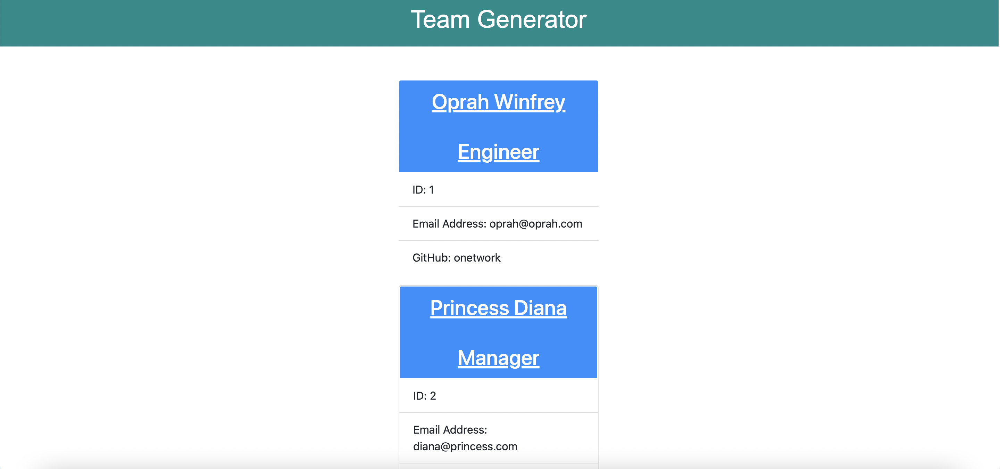

# Team Profile Generator

  
## Description
This app will allow the user to quickly create profiles for different team members, their position and role. After the user fills out the questionaire on their terminal, a new HTML will be created dynamically with a clean and clear UI design.
## Table of Contents 
- [Installation](#installation)
- [Usage](#usage)
- [License](#license)
- [Contributors](#contributors)
- [Testing](#test)
- [Questions](#questions)
## Installation
1) Download the contents of each file and folder. 2) Install Inquirer package depency. 3) or simply copy the contents of the package.json in the app, and then run "npm i" for the proper dependencies to be installed.
## Usage
- [Click](https://drive.google.com/file/d/11PajUS_RKGp2vCGpsWRkz2z6UrcOxdLL/view) this link watch video walkthrough for this app. 
- 
## License
This application is under the MIT license.  
## Contributors
NA.
## Testing
This application was tested using Local Browser
## Questions
For more information, please visit [GitHub Profile](https://github.com/agonzalvez/).  
For any questions, you may email me at agonzalvez1@gmail.com.